 

# 🟩 Minecraft Bot

**An AI-powered Minecraft Java bot and multi-agent playground.**

Explore, collect resources, craft, survive, and experiment with multiple AI models in the same Minecraft world — with live controls and useful diagnostics.

**[Quick start](#-quick-start)** · **[Features](#-features)** · **[AI Arena](#-ai-arena)** · **[Commands](#-useful-commands)** · **[Troubleshooting](#-troubleshooting)**

---

## ✨ What is Minecraft Bot?

**Minecraft Bot** combines the [Mindcraft](https://github.com/mindcraft-bots/mindcraft) agent framework with [Mineflayer](https://github.com/PrismarineJS/mineflayer) and a custom **AI Arena** control center. It lets language-model-driven bots act inside **Minecraft: Java Edition**, rather than merely talk about the game.

There are **two ways to run it**:

| Mode | What it does | Start with |
| :--- | :--- | :--- |
| 🎮 **Classic bot** | Runs configured Mindcraft agent profiles with in-game chat and skills | `npm start` |
| 🧠 **AI Arena** | Runs selected AI agent slots with a local browser dashboard, per-agent controls, model routing, and telemetry | `npm run arena` |

> [!IMPORTANT]
> This is an experimental agent project, not a guaranteed AFK survival solution. Models can make mistakes, pathfinding can get stuck, and API services may be limited or unavailable.

## 🚀 Features

| | Feature | Details |
| :---: | :--- | :--- |
| 🤖 | **AI-driven gameplay** | Let agents plan and attempt exploration, resource gathering, crafting, movement, and survival tasks. |
| 💬 | **In-game conversations** | Chat with your bot and, in supported multi-agent setups, let bots exchange Minecraft messages. |
| 🧭 | **Navigation & skills** | Built on Mineflayer's pathfinding and in-world action libraries. |
| 🧠 | **Multiple model options** | Profiles and cloud routes support configurable model providers; availability depends on your account and setup. |
| 🏟️ | **Multi-agent AI Arena** | Configure up to **four** agent slots and observe them in one local Minecraft world. |
| 📊 | **Browser control center** | Inspect agent state, activity, plan history, diagnostics, and provider budgets. |
| 🛟 | **Recovery & safety controls** | Pause, resume, stop, and use an emergency stop; endurance mode includes persisted state and cloud error handling. |
| 🧪 | **Testing tools** | Dedicated Arena tests, import checks, linting, and Minecraft task files are included. |

## 🖥️ In action

 
Illustrative animation — actual output varies with your configuration, Minecraft connection, and AI provider.

## ⚡ Quick start

### Prerequisites

- **Minecraft: Java Edition** and a world you can open to LAN.
- **Node.js 22 or newer** with npm.
- A working **AI model/backend** and its credentials, when your selected profile requires them.
- A local Minecraft world or reachable server appropriate to your selected mode.

### 🪟 Windows — easiest path for AI Arena

1. Clone or download the repository.
2. Double-click **`SETUP.bat`**. This installs dependencies and creates configuration files without replacing existing settings.
3. Add the appropriate API key to **`keys.json`**.
4. Check **`arena.config.json`** and **`brain.config.json`**. Choose the agents and routes you actually intend to use.
5. Launch a Minecraft Java world and select **Open to LAN**. Use port **55916**, or update the configured port to match the one Minecraft displays.
6. Run **`START_TEST.bat`** for a one-agent trial, or **`START_AI_ARENA.bat`** for the configured Arena.

The Arena dashboard runs locally at **http://localhost:8790** by default.

### 🐧 Linux / macOS / terminal

~~~bash
git clone https://github.com/shreeharsh-patil/Minecraft-Bot.git
cd Minecraft-Bot

# Generate local configuration, install dependencies, and check imports
node control-center/setup.js

# Add credentials to keys.json, configure your agents, then open Minecraft to LAN
npm run arena:test-agent
~~~

For multiple enabled agents, run:

~~~bash
npm run arena
~~~

> [!TIP]
> The project includes a Windows-friendly setup launcher, but the underlying Node.js setup and Arena scripts are cross-platform. If optional native graphics dependencies cause installation problems, see [FAQ.md](FAQ.md).

## 🏟️ AI Arena

The control center is designed for experimenting with AI agents **in the same Minecraft world**. The sample configuration defines slots named **Gemini**, **DeepSeek**, **GPT**, and **Nemotron**; these are *configurable identities*, not a promise that every listed provider is active or free.

| 🌿 Gemini | 🌊 DeepSeek | 🟨 GPT | 🟪 Nemotron |
| :---: | :---: | :---: | :---: |
| Agent slot | Agent slot | Agent slot | Agent slot |
| Configurable | Configurable | Configurable | Configurable |

The dashboard provides live agent status, in-world event data, plans and history, diagnostics, and controls. Endurance mode adds shared provider budgets, retries/cooldowns, preserved agent state, and separation between a bot's Minecraft connection and its cloud-brain availability.

**Relevant configuration files**

| File | Purpose |
| :--- | :--- |
| `arena.config.json` | Minecraft LAN host/port, dashboard port, enabled agents, display names, and their profiles |
| `brain.config.json` | Cloud model routes, API key environment-variable names, quotas, pacing, and provider policy |
| `keys.json` | Local API credentials — **never commit real keys** |
| `profiles/arena/*.json` | Per-agent names and model/profile configuration |
| `settings.js` | Classic bot's Minecraft connection, behavior, and profiles |

The `*.example.json` files in the repository are templates. Running setup copies them into local configuration files when those files do not yet exist.

> [!CAUTION]
> The example cloud settings are **not verified provider entitlements**. In `brain.config.json`, confirm your real API access and request/token limits before setting `freeAccessConfirmed` and `limitsConfirmed`. Do not assume free or unlimited API usage. Paid fallback is disabled in the supplied example.

### Ports and connectivity

| Service | Default | Note |
| :--- | :--- | :--- |
| Minecraft LAN | `55916` | Match the port shown in **Open to LAN** |
| AI Arena dashboard | `8790` | Local browser dashboard |
| Classic Mindcraft server UI | `8080` | Configured in `settings.js` |

**Arena currently requires a local Minecraft host** (`localhost` / loopback) in its config validation. For external servers (including hosted servers), investigate the **classic mode's** `settings.js` connection options instead; remote Arena connections are not currently supported by its configured host validation.

## 💬 Classic Mindcraft bot

Use this path if you want a regular conversational Minecraft bot rather than the experiment dashboard.

1. Configure the Minecraft host, port, authentication, and profiles in `settings.js`.
2. Add the API credentials required by your chosen profile to `keys.json`.
3. Set a model in your profile that you can actually access. The included profiles are examples and may require additional setup or different model access.
4. Start the bot:

~~~bash
npm start
~~~

You can run a different selection of profiles using the supported CLI:

~~~bash
node main.js --profiles ./profiles/gpt.json
~~~

The `settings.js` file also contains switches for in-game chat, memory loading, bot-view rendering, and action restrictions.

## 🧰 Useful commands

~~~bash
npm start                  # Classic bot
npm run arena              # AI Arena
npm run arena:test-agent   # One-agent test mode
npm run arena:check        # Dependency/import check
npm run test:arena         # Arena test suite
npm run lint:arena         # Arena ESLint
~~~

On Windows, you can also use `STOP_AI_ARENA.bat` to stop the Arena.

## 🗂️ Project structure

~~~text
Minecraft-Bot/
├── .github/assets/           # Animated README artwork
├── control-center/
│   ├── backend/              # Local API, lifecycle, run history
│   ├── brain/                # Model routing, quotas, planning
│   ├── frontend/             # Arena dashboard
│   ├── telemetry/            # Agent and action events
│   └── tests/                # Arena tests
├── profiles/                 # Classic and Arena model profiles
├── src/                      # Mindcraft / Mineflayer gameplay logic
├── tasks/                    # Minecraft task and evaluation tooling
├── main.js                   # Classic bot entry point
├── settings.js               # Classic bot settings
├── arena.config.example.json # Arena config template
├── brain.config.example.json # Cloud brain config template
├── keys.example.json         # API key template
└── package.json
~~~

## 🛠️ Troubleshooting

<b>❌ Bot cannot connect to Minecraft</b>

Make sure the Java world is open to LAN, the Minecraft version is compatible, and the LAN port matches `settings.js` or `arena.config.json`. Also confirm the server's authentication mode matches your bot.

<b>🔑 AI model / API connection fails</b>

Check `keys.json`, the selected profile or route, the provider's account access, quotas, and whether that route is enabled. Arena cloud preflight can intentionally block routes with unconfirmed provider access or limits.

<b>📦 npm install fails or native dependency errors appear</b>

Use a supported Node.js release (22+ for the current Arena code), rerun setup, and consult [FAQ.md](FAQ.md). The setup script installs without optional dependencies to avoid unnecessary native graphics builds.

<b>🧱 Bot gets stuck or fails at a task</b>

Mineflayer pathfinding and LLM plans aren't perfect. Inspect Arena diagnostics, verify game permissions and block access, and confirm the bot's requested resources and crafting recipes exist in the world.

## 🤝 Contributing

Ideas, fixes, and documentation improvements are welcome. Open an [issue](https://github.com/shreeharsh-patil/Minecraft-Bot/issues) with steps to reproduce a problem, or propose a pull request.

For tasks and evaluation experiments, see [minecollab.md](minecollab.md). For common installation and gameplay problems, see [FAQ.md](FAQ.md).

## 🙌 Credits

This project builds on the [Mindcraft project](https://github.com/mindcraft-bots/mindcraft) and the [PrismarineJS / Mineflayer ecosystem](https://github.com/PrismarineJS/mineflayer). Credit belongs to their respective authors and contributors.

Minecraft is a trademark of Mojang Studios / Microsoft. This repository is an independent community project and is not affiliated with or endorsed by them.

---

**⛏️ Give your Minecraft world a little more intelligence.**

[**⭐ Star this repository**](https://github.com/shreeharsh-patil/Minecraft-Bot) · [**🐛 Report a bug**](https://github.com/shreeharsh-patil/Minecraft-Bot/issues) · [**🍴 Fork**](https://github.com/shreeharsh-patil/Minecraft-Bot/fork)

Created by <a href="https://github.com/shreeharsh-patil">shreeharsh-patil</a> · Animated art created for this repository

